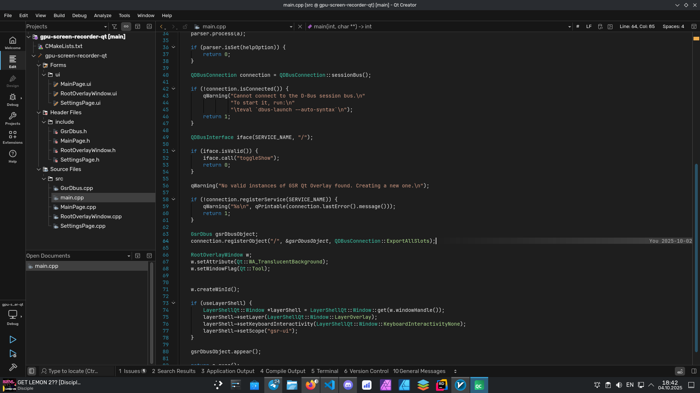
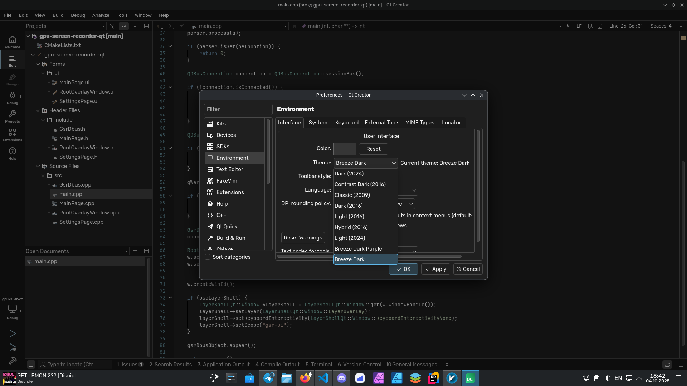

# Qt Creator Breeze Dark theme

Created to integrate Qt Creator into my KDE Plasma workflow.




## Available Themes

- **Breeze Dark**: Original blue-accented dark theme.
- **Breeze Dark Purple**: Purple-accented variation of the dark theme (you need to select the corresponding color in plasma settings)

## Installation
```bash
git clone https://github.com/relativemodder/qt-creator-breeze-dark
cd qt-creator-breeze-dark
./install.sh
```
